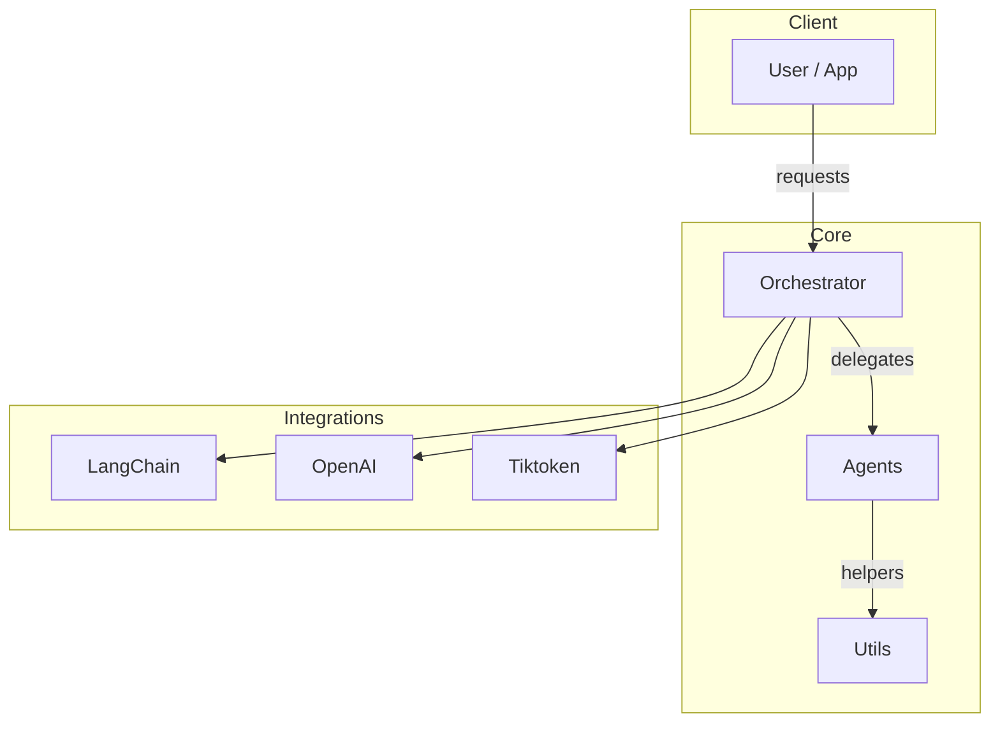

# Project

A Python project integrating LangChain, OpenAI, and related tooling. This repository includes modular components for building agentic workflows.

- Status: alpha (0.1.0)
- Python: >= 3.10

## Installation

- Editable install for local development:
  - pip install -e .

- Optional: install dev tools
  - pip install -r requirements.txt

## Quick start

- Environment
  - Copy .env.example to .env and provide required variables (e.g., OpenAI credentials if applicable)

- Run tests
  - pytest -q

- Examples
  - See examples/ for runnable notebooks or scripts

## Usage

Below is a high-level example outline. Adapt to the concrete classes/functions in this repository.

- Import your core modules
  - from agentic import ...
  - from agentic.orchestrator import ...
  - from agentic.agents import ...

- Minimal pattern (pseudo-code)
  - orchestrator = Orchestrator(...)
  - result = orchestrator.run(input={...})
  - print(result)

See examples/ and tests/ for concrete usages.

## Architecture

This project follows a modular layout to enable composability and testing. A conceptual view:

- Orchestrator: central coordinator for workflows
- Agents: specialized workers that perform tasks (retrieval, reasoning, formatting)
- Utils: shared utilities for logging, parsing, prompting, etc.
- Integrations: external libraries and APIs

## Development

- Code style
  - Ruff and Black configured via pyproject.toml
  - Line length: 100

- Pre-commit
  - Optionally enable hooks defined in .pre-commit-config.yaml
  - pre-commit install

- Testing
  - pytest -q

## Packaging

- Build a wheel and sdist
  - python -m build

- Editable install (recommended for local dev)
  - pip install -e .

- Private PyPI (optional)
  - Build: python -m build
  - Upload: twine upload --repository-url https://your.private.pypi/simple dist/*
  - Configure credentials via environment variables or keyring; avoid hardcoding secrets.

## Versioning and Releases

- This repository uses semantic versioning
- Current version is defined in pyproject.toml (project.version)
- Tagging a release
  - git tag -a v0.1.0 -m "Release v0.1.0"
  - git push origin v0.1.0

See CHANGELOG.md for release notes.

## Contributing

- Branching
  - Create a feature branch from main: git checkout -b feat/short-description

- Commit conventions
  - Use conventional commits when possible (feat:, fix:, docs:, refactor:, test:, chore:)

- Pull requests
  - Include tests for new behavior
  - Update documentation where applicable
  - Ensure lint and tests pass locally

- Code review
  - Keep PRs focused and small where possible

## License

- See LICENSE (if present) or specify your chosen license.

