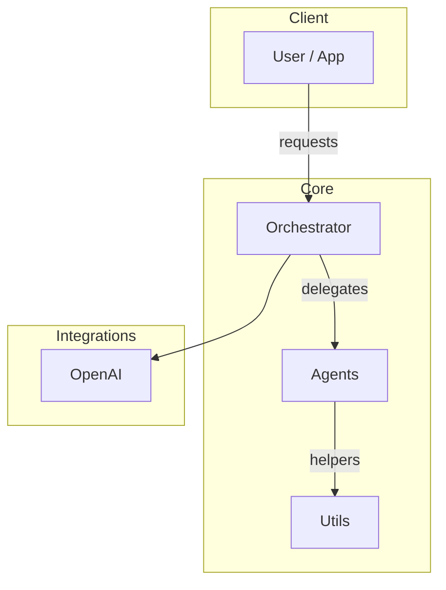

# Agentic

Agentic document analysis system with an orchestrator that coordinates specialist agents. Includes ingestion utilities, document classification, agent registry, orchestrator with peer feedback, and a CLI with HTML report rendering.

- Status: alpha (0.1.0)
- Python: >= 3.10

## Installation

- Editable install for local development:
  - pip install -e .

- Optional tools:
  - pip install -r requirements.txt

- Environment variables (optional for real LLMs):
  - export OPENAI_API_KEY={{OPENAI_API_KEY}}

## CLI Usage

After installing (-e recommended), the command `agentic` is available.

- One-shot analysis:
  - agentic analyze path/to/file --open-browser --verbose

- Iterative loop (default 5 iterations):
  - agentic loop path/to/file --max 5 --open-browser --verbose

### Model selection
- If you do NOT pass --model:
  - Analysis uses "gpt-5"
  - Classifier uses "gpt-5-mini"
- If you pass --model foo:
  - Analysis uses "foo"
  - Classifier uses "foo-mini" (if foo already ends with -mini, uses foo for both)
- If OPENAI_API_KEY is not set or the OpenAI client fails to initialize, the system falls back to local stubs (no API calls).

Examples:
- OPENAI_API_KEY={{OPENAI_API_KEY}} agentic analyze examples/contract.txt --verbose
- OPENAI_API_KEY={{OPENAI_API_KEY}} agentic analyze examples/contract.txt --model gpt-4o
- OPENAI_API_KEY={{OPENAI_API_KEY}} agentic analyze examples/contract.txt --model gpt-5-mini

## Python API (outline)

- from agentic.orchestrator import Orchestrator
- from agentic.utils.classifier import DocumentClassifier
- from agentic.utils.ingest import ingest

Example outline:
- doc = ingest(path="examples/contract.txt")
- orch = Orchestrator(...)
- report = await orch.analyze(doc.text)

## Architecture

```mermaid
flowchart TD
  subgraph Client
    U[User / App]
  end

  subgraph Core
    O[Orchestrator]
    A1[Agents]
    UTI[Utils]
  end

  subgraph Integrations
    OAI[OpenAI]
  end

  U -->|requests| O
  O -->|delegates| A1
  A1 -->|helpers| UTI
  O --> OAI
```

- Orchestrator: central coordinator for workflows (classification → agents → feedback → synthesis)
- Agents: specialized workers per document type
- Utils: ingestion, classification, LLM adapters, HTML report rendering

## Development

- Code style
  - Ruff and Black via pyproject.toml (line length 100)

- Testing
  - pytest -q

## Packaging

- Build a wheel and sdist
  - python -m build

- Editable install (recommended for local dev)
  - pip install -e .

## Versioning and Releases

- Semantic versioning; current version in pyproject.toml
- Tagging a release
  - git tag -a v0.1.0 -m "Release v0.1.0"
  - git push origin v0.1.0

See CHANGELOG.md for release notes.

## Contributing

- Branching
  - git checkout -b feat/short-description

- Commit conventions
  - Conventional commits when possible (feat:, fix:, docs:, refactor:, test:, chore:)

- Pull requests
  - Include tests; update documentation
  - Ensure lint and tests pass locally

## License

- See LICENSE (if present) or specify your chosen license.

